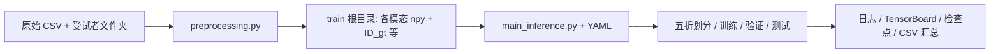

# 多模态帕金森病（PD）估计

本仓库实现**视觉 + 音频**多模态特征下的 PD 相关二分类/估计实验代码，包含**数据预处理（滑窗落盘）**、**三种建模方式（纯视觉 / 纯音频 / 视听融合）**以及**受试者级五折交叉验证**训练与评估。

---

## 1. 项目结构

```
Multi-modal PD Estimation based on Gyp-attentional Fusion/
├── preprocessing/                 # 原始特征 → 滑窗 .npy + 全局 GT
│   └── preprocessing.py
├── models/
│   ├── AV-attention/              # 视听双分支 + 注意力融合（主实验）
│   │   ├── main_inference.py      # 训练入口（5-fold）
│   │   ├── utils.py               # DataLoader、优化器、损失、指标、保存权重
│   │   ├── config/              # 推理/消融 YAML
│   │   ├── dataset/               # PDDataset、ToTensor
│   │   └── models/                # ConvLSTM、fusion(PDAFFusion)、evaluator、SAM、Lookahead 等
│   ├── Visual_only/               # 仅视觉分支 + MLP 分类头
│   └── Audio_only/                # 仅音频分支 + MLP 分类头
└── docs/                          # 补充文档（如代码边界问题说明）
```

三个子项目（`Visual_only` / `Audio_only` / `AV-attention`）彼此独立：各自包含 `main_inference.py`、`utils.py`、`dataset` 与 `config`，需在**对应目录下**运行，以保证 `import utils`、`import models` 路径正确。

---

## 2. 整体流程



1. **预处理**：按受试者读取面部关键点、AU、位姿、HOG、音频波形等，按滑窗切分并保存为与 `PDDataset` 约定一致的目录结构；同时生成 `ID_gt.npy`、`pd_binary_gt.npy` 等标签文件。
2. **训练**：从配置读取数据根目录，将 `train` 与 `test` 目录拼接为完整样本池（或使用 `ALL_ROOT_DIR`），按**受试者 ID 分组**做 **StratifiedGroupKFold**，再在训练折内划分验证集；循环 epoch，支持早停、CB-Focal BCE、Lookahead 等。
3. **输出**：每折日志、`runs` TensorBoard、`epoch_metrics.csv`、最佳权重 `pth`，全部折结束后汇总 `five_fold_results.csv` 与 `run_session_summary.json`。

---

## 3. 预处理（`preprocessing/preprocessing.py`）

### 3.1 作用

- 对每位受试者做**时间对齐的滑窗**（视觉帧与音频特征插值到同一窗口长度）。
- 输出目录需包含与 `dataset.py` 一致的子文件夹，例如：`facial_keypoints`、`gaze_vectors`、`action_units`、`position_rotation`、`hog_features`、`audio/` 下各谱特征与医学标量占位等。

### 3.2 常用命令示例

在项目根目录执行（请按本机路径修改）：

```bash
python preprocessing/preprocessing.py ^
  --data_root "<原始数据根目录>" ^
  --output_root "<输出 train 根目录>" ^
  --csv "<含 Participant_ID, PD_Binary, PD_Score, Gender 等的 CSV>" ^
  --window 10.0 ^
  --overlap 2.0 ^
  --visual_sr 30
```

### 3.3 数据约定

- 窗口文件名使用**定宽受试者编号**（如 `000042-00_*.npy`），保证 `np.sort(os.listdir(...))` 与标签行顺序一致。
- CSV 中 `Participant_ID` 不重复；处理顺序按 ID 数值排序。
- 音频医学标量（MDVP 等）若未提取，可写占位 `0.0`，保证路径存在。

依赖：`numpy`、`pandas`、`librosa` 等。

---

## 4. 训练数据配置（YAML）

各模型子目录下 `config/config_inference.yaml`（及消融配置）通常包含：

| 区块 | 含义 |
|------|------|
| `OUTPUT_DIR` / `CKPTS_DIR` | 日志与权重输出路径 |
| `DATA` | `TRAIN_ROOT_DIR`、`TEST_ROOT_DIR`、`VALIDATION_ROOT_DIR`、`BATCH_SIZE`、`VISUAL_WITH_FACE3D` 等 |
| `MODEL` | `EPOCHS`、`EARLY_STOP_PATIENCE`、`VISUAL_NET`、`AUDIO_NET`、`FUSION_NET`、`EVALUATOR`、`CRITERION`、`OPTIMIZER`、`SCHEDULER`、`WEIGHTS` |

- **`WEIGHTS`**：`TYPE` 可为 `new`（随机初始化）、`absolute_path`（从 `CUSTOM_ABSOLUTE_PATH` 加载）、`last`（目录内最新匹配文件）等；`INCLUDED` 列出要加载的子模块（如 `visual_net`、`audio_net`、`fusion_net`、`evaluator`）。
- **融合（仅 AV-attention）**：`FUSION_NET.USE_PDAF_PAPER: True` 时使用 `PDAFFusion`（跨模态注意力 + IAFF 风格融合）；否则为 `SimpleConcatFusion`。

训练前请将 YAML 中数据路径、权重路径改为本机绝对路径。

---

## 5. 运行训练

在 **CUDA** 环境建议先 `cd` 到对应模型目录，再执行：

### 5.1 视听融合（AV-attention）

```bash
cd models/AV-attention
python main_inference.py --config_file config/config_inference.yaml --device cuda --gpu 0
```

### 5.2 仅视觉（Visual_only）

```bash
cd models/Visual_only
python main_inference.py --config_file config/config_inference.yaml --device cuda --gpu 0
```

### 5.3 仅音频（Audio_only）

```bash
cd models/Audio_only
python main_inference.py --config_file config/config_inference.yaml --device cuda --gpu 0
```

说明：

- 使用 `autolab_core.YamlConfig` 加载配置；默认会进行 **5 折**循环。
- `--gpu` 仅在 `--device cuda` 且代码中正确识别为 CUDA 时用于设置可见 GPU（具体行为以当前 `main_inference.py` 实现为准）。
- 多 GPU 时若 `utils.get_models` 中根据 `args.gpu` 使用 `DataParallel`，需保证 GPU 数量与配置一致。

主要 Python 依赖包括但不限于：**PyTorch**、**torchvision**、**scikit-learn**、**pandas**、**numpy**、**tqdm**、**tensorboard**、**autolab_core**、**torch_optimizer**（若使用 RAdam/Ranger 等）。

---

## 6. 模型与数据流概要

### 6.1 视觉分支（`ConvLSTM_Visual`）

- 输入：`(B, T, F, C)`，内部 permute 为 `(B, C, F, T)` 形式进入卷积 + Transformer/时序模块（见 `models/convlstm.py`）。
- 输出：固定维度向量（如 256 维）供融合或分类头使用。

### 6.2 音频分支（`ConvLSTM_Audio`）

- 输入：`(B, C, T)`，通道数由配置 `AUDIO_NET.INPUT_DIM` 与 `dataset` 中拼接的谱特征一致（如 MFCC 及其差分共 39 维）。
- 输出：与视觉同维向量。

### 6.3 融合（`models/fusion.py`）

- **`PDAFFusion`**：对视觉/音频向量做 `MultiheadAttention` 交叉更新，拼接后经 `IAFF_Paper` 与线性层得到融合向量。
- **`SimpleConcatFusion`**：拼接双模态向量后线性投影。

### 6.4 分类头（`Evaluator`）

- 当前配置多为 `pd-binary`：MLP 输出 logits，与 BCE / CB-Focal 等损失配合。

### 6.5 数据集（`dataset/PDDataset`）

- 从 `root_dir` 加载 `ID_gt.npy`、`pd_binary_gt.npy` 等，按索引对齐各子文件夹中**排序后**同序的 `.npy` 文件。
- `VISUAL_WITH_FACE3D: True` 时拼接面部关键点、位姿与 AU（扩展到 3 通道形式）；音频为多个谱特征在通道维拼接。

---

## 7. 交叉验证与指标

- **划分**：`StratifiedGroupKFold`（`groups=受试者ID`）保证同一受试者不出现在训练与测试折的交集中；训练折内再用 `GroupShuffleSplit` 划分验证集。
- **采样**：训练集常用 `WeightedRandomSampler` 缓解类别不平衡。
- **指标**：准确率、混淆矩阵、TPR/TNR、Precision、Recall、F1；验证集 loss 用于早停与保存；测试集可记录最佳 F1/Acc 对应 epoch。

---

## 8. 输出文件说明

| 产物 | 说明 |
|------|------|
| `fold_k/*.log` | 文本日志 |
| `fold_k/runs/` | TensorBoard 事件文件 |
| `fold_k/epoch_metrics.csv` | 每 epoch 训练/验证/测试指标 |
| `CKPTS_DIR/.../*.pth` | 检查点（含各子网络 `state_dict`） |
| `five_fold_results.csv` | 各折最佳结果汇总 |
| `run_session_summary.json` | 一次完整 5 折运行的元信息与路径 |

---

## 9. 其他说明

- **消融实验**：`config` 下另有 `config_ablation_*.yaml`，可切换融合方式或单模态结构，用法与主配置相同。
- **更细的逻辑风险**（混淆矩阵边界、CB 损失在某一类样本为 0 等）见 `docs/代码逻辑与边界问题说明.md`（若存在）。

---
